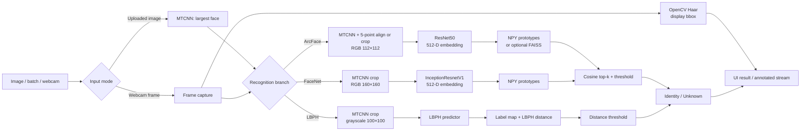

<div align="center">


<p>
  
  
  
  
  
</p>

**Research-oriented comparison of ArcFace, FaceNet, and LBPH for face identification with unknown rejection.**

</div>

---

# Face Recognition System

This repository implements an end-to-end face-recognition research system: CelebA preparation, model training, reference-database construction, thresholded identity matching, evaluation utilities, visual analysis, and two interactive demos.

The primary task is **gallery-based face identification**. Given an image or webcam frame, the system selects the largest detected face, produces either a deep embedding or an LBPH prediction, searches enrolled identities, and returns the best identity or `Unknown`. The gallery is closed and finite, while threshold rejection gives the inference flow a limited open-set behavior. It is not a complete open-set recognition benchmark or a production biometric service.

> [!IMPORTANT]
> Model checkpoints, datasets, embedding databases, FAISS indexes, and reproducible benchmark reports are not committed. Cloning the repository alone is insufficient for recognition. See [Required artifacts](#required-artifacts).

## Problem definition

The repository separates five related tasks:

- **Face detection** locates a face and returns a bounding box; MTCNN and RetinaFace can also return five landmarks.
- **Face alignment** warps landmark coordinates to the canonical ArcFace template. When alignment is unavailable, supported paths fall back to a face crop or resized image.
- **Face embedding** maps a processed face to a normalized 512-dimensional vector with ArcFace or FaceNet.
- **Face verification** appears in training/evaluation utilities as same-person versus different-person pair classification at a cosine threshold.
- **Face identification / recognition** compares a query against enrolled identities, retrieves the best match, and applies a model-specific rejection threshold.

Inputs are image files, uploaded image batches, or server-side webcam frames. Outputs include identity, score or distance, top matches where implemented, face-detection metadata, and optional visualization files.

## Technical highlights

- Three recognition branches: ResNet50 ArcFace, InceptionResnetV1 FaceNet, and OpenCV LBPH.
- MTCNN detection with five-point landmarks; optional RetinaFace and Haar Cascade backends in the detector module.
- Separate preprocessing contracts for 112×112 ArcFace, 160×160 FaceNet, and 100×100 grayscale LBPH.
- L2-normalized deep embeddings with cosine-similarity matching and threshold-based `Unknown` rejection.
- One prototype embedding per enrolled identity, built by averaging all valid reference-image embeddings.
- Optional ArcFace prototype indexing with FAISS `IndexFlatIP`; direct NPY dictionary search remains the Flask default.
- Pair-based verification checks, identification metrics, ROC/AUC/EER plotting, confusion matrices, and threshold sweeps.
- Flask workflows for single image, batch, webcam, and background database building, plus a separate minimal Streamlit demo.

## System architecture



The realtime path uses Haar Cascade only to draw display bounding boxes. Each selected recognition branch separately preprocesses the saved frame: ArcFace and FaceNet use their MTCNN-based paths, while LBPH runs its own MTCNN crop before prediction.

## Recognition methods

| Method | Implementation | Input and representation | Training objective | Recognition score | Repository-level strength | Limitation |
| --- | --- | --- | --- | --- | --- | --- |
| **ArcFace** | ResNet50 backbone, ImageNet initialization when enabled, 512-D projection, ArcMargin classification head | Landmark-aligned or cropped RGB face, 112×112, normalized with mean/std `0.5`; L2-normalized embedding | Cross-entropy over additive angular-margin logits | Cosine similarity; higher is better | Explicit angular-margin training and canonical five-point alignment | Requires a project checkpoint and enrolled embeddings; threshold needs validation-domain calibration |
| **FaceNet** | `facenet_pytorch.InceptionResnetV1`, VGGFace2 initialization, 512-D output | MTCNN-cropped RGB face, 160×160, normalized with mean/std `0.5`; L2-normalized embedding | Triplet margin loss with random, semi-hard, or batch-hard mining | Cosine similarity in web inference; L2 triplet distances during training | Pretrained embedding backbone and online mining support | Detection path crops rather than applying the ArcFace landmark template |
| **LBPH** | `cv2.face.LBPHFaceRecognizer` | MTCNN crop with raw-image fallback, grayscale, 100×100; local binary-pattern histograms | Native LBPH fitting over integer labels | LBPH distance; lower is better | Lightweight traditional-CV baseline with no neural checkpoint | Sensitive to capture conditions; distance is not comparable with cosine similarity |

### ArcFace branch

`models/arcface/arcface_model.py` builds a ResNet50 feature extractor, a 512-D embedding layer, and an `ArcMarginProduct` head. Labels activate the angular-margin classification path during training; inference omits labels and returns embeddings. `inference/extract_embeddings.py` and `RecognitionEngine` L2-normalize embeddings before matching.

Default `configs/arcface_config.yaml` settings include 112×112 input, batch size 128, 150 epochs, SGD at `0.01`, step scheduling, warmup, mixed precision, early stopping, and ArcFace scale/margin `64.0/0.1`. `configs/arcface_kaggle.yaml` is a separate 250-epoch cosine-scheduler profile with margin `0.2`; config values are experiment settings, not reported benchmark results.

### FaceNet branch

`models/facenet/facenet_model.py` wraps VGGFace2-pretrained `InceptionResnetV1` and keeps its 512-D embedding unless another projection size is configured. Training uses `TripletMarginLoss`. The default CLI selects online semi-hard mining; random and batch-hard strategies are also available.

Default `configs/facenet_config.yaml` settings include 160×160 input, batch size 32, 30 epochs, Adam at `3e-4`, StepLR, triplet margin `0.5`, and four images per identity for online mining. The dataloader checks that train and validation identity folders do not overlap.

### LBPH branch

`models/lbphmodel/train_lbph_script.py` assigns stable integer labels from sorted identity folders, detects/crops faces by default, converts them to 100×100 grayscale images, and trains OpenCV LBPH with radius `1`, eight neighbors, and an `8×8` grid by default. It saves `lbph_model.xml` and `label_map.npy`.

Inference accepts a prediction when LBPH distance is at or below the configured threshold (`100` in `configs/lbph_config.yaml`). The web UI also derives a display-only normalized confidence from distance. That value is not a calibrated probability and must not be compared directly with ArcFace or FaceNet cosine scores. The batch page currently chooses a `best_model` from these heterogeneous display scores; treat that label as a UI heuristic, not a valid cross-model benchmark.

## Face detection, alignment, and preprocessing

`preprocessing/face_detector.py` supports three backends:

| Backend | Status | Landmarks | Selection behavior |
| --- | --- | --- | --- |
| MTCNN from `facenet-pytorch` | Default for preprocessing, uploaded-image inference, and database creation | Five points | Filters at confidence `0.9`, minimum face size 20 px, then selects largest valid face |
| RetinaFace | Optional; falls back to MTCNN when import fails | Five points | Applies configured confidence/minimum-size filters and largest-face selection |
| OpenCV Haar Cascade | Available without landmarks; used for realtime display detection | None | Selects largest detected face |

Important branch differences:

- **ArcFace:** estimates a similarity transform from five landmarks to the canonical 112×112 template. Missing `scikit-image`, landmarks, or successful alignment triggers crop-based fallback in supported inference paths.
- **FaceNet:** uses MTCNN detection and a margin crop resized to 160×160. It does not apply the ArcFace canonical warp in its main inference path.
- **LBPH:** uses MTCNN crop with margin `0.2`, resizes to 100×100, then converts BGR to grayscale. Failed detection falls back to resizing the source image.
- **Multi-face images:** current high-level recognition flows use one face, normally the largest accepted detection. They do not return identities for every face in an image.

## Dataset and data preparation

### Dataset source

CelebA is the repository's primary data workflow. Raw images and generated datasets are not included. The main preprocessor expects:

```text
data/
├── img_align_celeba/
│   └── <image>.jpg
└── meta_origin/
    ├── identity_CelebA.txt
    ├── list_landmarks_align_celeba.csv
    ├── list_attr_celeba.csv              # optional
    └── list_bbox_celeba.csv              # optional
```

`identity_CelebA.txt` supplies identity labels. Five-point landmark metadata enables canonical alignment. Attributes and bounding boxes are loaded when present but are not required for label generation.

### Preprocessing workflow

```text
CelebA images + identity/landmark metadata
    → remove identities below the minimum image count
    → group images by identity
    → align originals to 112×112
    → augment underrepresented identities
    → split into train / validation / test
    → write folder trees and metadata CSV files
```

Run the configurable local pipeline:

```bash
python preprocessing/celeba_preprocessing.py \
  --images-dir data/img_align_celeba \
  --meta-dir data/meta_origin \
  --output-dir data/CelebA_Aligned_Balanced \
  --min-images 5 \
  --augment-threshold 10 \
  --target-min 10 \
  --split-method by_identity \
  --seed 42
```

The script supports `by_image` and `by_identity`; its CLI default is `by_image`. Use split policy intentionally: FaceNet's default config expects non-overlapping identities (`by_id` metadata notation), while classification-oriented experiments may require shared classes across splits.

Generated structure:

```text
data/CelebA_Aligned_Balanced/
├── train/<identity>/<image>.jpg
├── val/<identity>/<image>.jpg
├── test/<identity>/<image>.jpg
└── metadata/
    ├── train_labels.csv
    ├── val_labels.csv
    ├── test_labels.csv
    ├── global_id_mapping.csv
    └── dataset_config.json
```

The preprocessing code removes identities with fewer than five images by default and augments identities with 5–9 images toward ten images. Offline augmentation includes horizontal flips, small rotations, color changes, and optional noise/blur when `albumentations` is installed. ArcFace and FaceNet dataloaders apply additional training-time augmentation defined in their respective modules.

`configs/arcface_kaggle.yaml` contains descriptive metadata for a prepared balanced dataset with 9,343 classes and approximately 18 images per class. No generated dataset manifest is committed, so those values should be treated as configuration context rather than a repository-verifiable dataset release.

## Embedding database and identity decision

The default deep-model enrollment format is a NumPy-saved dictionary:

```python
{
    "identity_name": np.ndarray(shape=(512,), dtype=...),
    # one normalized prototype per identity
}
```

For each identity folder, `inference/extract_embeddings.py` extracts all valid image embeddings, averages them, L2-normalizes the mean, and stores one prototype. Query recognition then:

1. extracts and L2-normalizes a query embedding;
2. computes cosine similarity against all prototypes;
3. sorts candidates in descending similarity order;
4. returns up to five matches;
5. returns `Unknown` when the best score is below threshold.

`RecognitionEngine` defaults to threshold `0.5`; the Flask single-image and batch ArcFace/FaceNet flows normally use `0.65`, while realtime uses `0.5`. These are implementation defaults, not universally calibrated operating points. ArcFace web output also rescales displayed scores by `1.2` and clips them to `1.0`; treat UI values as display scores, not probabilities.

### Optional FAISS path

The ArcFace full extraction path can compute class prototypes and build a FAISS `IndexFlatIP` over normalized vectors. `RecognitionEngine` can load this index plus prototype/label files and perform top-k inner-product search. Flask currently instantiates ArcFace with `data/arcface_embeddings_db.npy`, so FAISS is an optional programmatic path rather than the default web-app backend.

## Training

Training follows the common sequence:

```text
prepared identity folders / metadata
    → model-specific DataLoader and augmentation
    → embedding model and objective
    → optimizer, scheduler, validation, early stopping
    → best/last checkpoint
    → enrollment embedding extraction
    → thresholded recognition
```

### ArcFace

```bash
python models/arcface/train_arcface.py \
  --config configs/arcface_config.yaml \
  --data_dir data/CelebA_Aligned_Balanced \
  --checkpoint_dir models/checkpoints/arcface
```

Optional CLI arguments: `--pretrained_backbone`, `--resume`, and `--reset_optimizer`. The trainer saves `arcface_best.pth`, `arcface_last.pth`, periodic epoch checkpoints, and training history. TensorBoard and embedding visualizations depend on config and installed optional packages.

### FaceNet

```bash
python models/facenet/train_facenet.py \
  --config configs/facenet_config.yaml \
  --data_dir data/CelebA_Aligned_Balanced \
  --mining semi_hard
```

Accepted mining strategies are `random`, `semi_hard`, and `hard`. The trainer saves `facenet_best.pth`, `facenet_last.pth`, and JSON training history. Current CLI has no resume argument.

### LBPH

```bash
python models/lbphmodel/train_lbph_script.py \
  --data-dir data/CelebA_Aligned_Balanced/train \
  --output-dir models/checkpoints/LBHP
```

Optional validation threshold search:

```bash
python models/lbphmodel/train_lbph_script.py \
  --data-dir data/CelebA_Aligned_Balanced/train \
  --output-dir models/checkpoints/LBHP \
  --find-threshold \
  --val-dir data/CelebA_Aligned_Balanced/val
```

Threshold search writes analysis beside the model and updates `configs/lbph_config.yaml`. It is therefore a state-changing training operation, not a read-only evaluation command.

### Kaggle and Colab

- `requirements-colab.txt` adds `albumentations`, TensorBoard, InsightFace, and GPU FAISS dependencies.
- `configs/arcface_kaggle.yaml` and `configs/facenet_kaggle.yaml` define Kaggle-oriented profiles.
- `notebooks/arcface_kaggle.ipynb`, `notebooks/facenet_kaggle.ipynb`, preprocessing notebooks, and model-specific evaluation notebooks provide interactive workflows.

The code falls back to CPU where implemented, but GPU training is the practical target for deep models. Install PyTorch/torchvision builds compatible with the runtime CUDA version instead of assuming a fixed CUDA release.

## Required artifacts

| Artifact | Expected path used by Flask | In Git | How to produce it |
| --- | --- | --- | --- |
| Prepared CelebA data | `data/CelebA_Aligned_Balanced/` | No | Run `preprocessing/celeba_preprocessing.py` or a preprocessing notebook |
| Enrollment images | `data/celeb/<identity>/<image>` for example DB commands | No | Supply a folder per enrolled identity |
| ArcFace checkpoint | `models/checkpoints/arcface/arcface_best.pth` | No | Train ArcFace or provide a compatible project checkpoint |
| FaceNet checkpoint | `models/checkpoints/facenet/facenet_best.pth` | No | Train FaceNet or provide a compatible project checkpoint |
| ArcFace prototype DB | `data/arcface_embeddings_db.npy` | No | Run ArcFace database extraction or use Database Builder |
| FaceNet prototype DB | `data/facenet_embeddings_db.npy` | No | Run FaceNet database extraction or use Database Builder |
| LBPH model and labels | `models/checkpoints/LBHP/lbph_model.xml`, `label_map.npy` | No | Run LBPH training or use Database Builder |
| FAISS index and mapping | Usually under `data/embeddings/` | No | Run optional ArcFace `full` extraction mode with CSV metadata |
| Evaluation outputs | `results/evaluation/` when generated | No reproducible report tracked | Call evaluation utilities with a defined test protocol |

### Build deep embedding databases

Enrollment input must use one subdirectory per identity:

```text
data/celeb/
├── person_a/
│   ├── image_01.jpg
│   └── image_02.jpg
└── person_b/
    └── image_01.jpg
```

ArcFace:

```bash
python inference/extract_embeddings.py \
  --mode db \
  --model-type arcface \
  --model-path models/checkpoints/arcface/arcface_best.pth \
  --data-dir data/celeb \
  --output-path data/arcface_embeddings_db.npy \
  --use-face-detection
```

FaceNet:

```bash
python inference/extract_embeddings.py \
  --mode db \
  --model-type facenet \
  --model-path models/checkpoints/facenet/facenet_best.pth \
  --data-dir data/celeb \
  --output-path data/facenet_embeddings_db.npy \
  --use-face-detection
```

`--no-face-detection` uses source images directly; use it only for data already cropped and normalized to the intended model contract. Additional Windows syntax is documented in [`docs/extract_embeddings.md`](docs/extract_embeddings.md), but logged values in that document are historical examples, not current benchmark evidence.

## Evaluation and results

`inference/evaluate.py` provides reusable functions rather than a dataset CLI. Implemented outputs include:

- accuracy, weighted/macro precision, recall, and F1;
- confidence-threshold sweep with acceptance (`known_ratio`);
- ROC curve, AUC, and an EER estimate for binary correctness labels;
- confusion matrix;
- generated Markdown report and plots.

ArcFace and FaceNet trainers also estimate pair-based verification accuracy by sampling positive/negative pairs and searching cosine thresholds. FaceNet logs triplet constraint accuracy, positive/negative distances, validation loss, and pair verification accuracy. LBPH evaluation utilities report accepted-sample accuracy and coverage at a distance threshold.

For a defensible comparison, keep gallery/query partitions fixed, calibrate each model's threshold on validation data, evaluate on a held-out query set, and report both recognition quality and rejection/coverage. Do not compare LBPH distance or its derived UI confidence directly with deep-model cosine similarity.

**No reproducible benchmark table is published here.** Evaluation code and historical notebook outputs exist, but the repository does not track the required checkpoints, generated dataset manifest, embedding databases, and complete evaluation artifacts needed to independently reproduce a model comparison. Consequently, this README makes no accuracy, AUC, EER, FPS, or state-of-the-art claim.

## Explainability visualizations

`inference/explainability.py` implements:

- ArcFace Grad-CAM, targeting `backbone.layer4` by default or the last convolutional layer as fallback;
- FaceNet activation-based CAM using `block8.conv2d` when available, because the implementation does not use embedding gradients for this branch;
- heatmap, overlay, and combined image generation.

Flask writes ArcFace and FaceNet overlays under `static/gradcam/` for uploaded single images. These heatmaps indicate spatial activation associated with the embedding path; they do not prove why an identity match is correct and are not a causal explanation of the final threshold decision.

## Applications

### Flask application

`web_app.py` is the main application entry point. Models are loaded lazily.

| UI route | Behavior |
| --- | --- |
| `/` | Upload one image, run ArcFace, FaceNet, and LBPH, show scores, detection metadata/bounding boxes, and available ArcFace/FaceNet CAM overlays |
| `/batch` | Process multiple images with all three methods |
| `/realtime` | Stream server-side webcam input and select ArcFace, FaceNet, or LBPH |
| `/database-builder` | Start background jobs to build ArcFace/FaceNet prototype databases or train LBPH; poll status and download generated artifacts |

Internal routes support the UI's video stream, model selection, job status, and downloads. They are not a versioned or authenticated production REST API. The Flask app runs with `debug=True`; deploy only in a controlled development environment.

Run from repository root:

```bash
python web_app.py
```

Open `http://127.0.0.1:5000`. Webcam capture uses camera index `0` on the machine running Flask, not the browser client's camera device.

### Streamlit demo

`app/app.py` is a separate single-image ArcFace demo built on a default `RecognitionEngine()`. That default does not receive a database path, so the current Streamlit entry point cannot return enrolled recognition results without code/configuration changes. Its UI also labels itself as illustrative. `streamlit` is not declared in project requirements.

To inspect the current demo:

```bash
python -m pip install streamlit
streamlit run app/app.py
```

## Installation

### Local environment

```bash
git clone git@github.com:sin0235/face-recognition-system.git
cd face-recognition-system
python -m venv .venv
source .venv/bin/activate
python -m pip install --upgrade pip
python -m pip install -r requirements.txt
```

`opencv-contrib-python` is required for `cv2.face` and LBPH. `requirements.txt` includes both `opencv-python` and `opencv-contrib-python`; verify that the resulting environment exposes `cv2.face`.

For CUDA, install PyTorch and torchvision wheels appropriate for the host driver/runtime. CUDA is optional for supported inference paths; code selects CPU when CUDA is unavailable.

### Reproduction order

1. Install local or notebook dependencies.
2. Obtain CelebA and required metadata outside Git.
3. Prepare aligned train/validation/test folders with a deliberate split policy.
4. Train a model or place compatible checkpoints at the expected paths.
5. Prepare enrollment folders and build ArcFace/FaceNet prototype databases; train LBPH and preserve its label map.
6. Calibrate model-specific thresholds on validation data.
7. Run the Flask app or invoke inference programmatically.
8. Evaluate against a fixed held-out protocol and retain generated reports with the exact config/checkpoint identifiers.

## Repository structure

```text
app/                         Standalone Streamlit demo
configs/                     ArcFace, FaceNet, LBPH, local, and Kaggle settings
docs/                        Supplemental embedding-extraction notes
inference/                   Recognition, enrollment, evaluation, CAM, and DB jobs
models/arcface/              ResNet50 ArcFace model, dataloaders, and trainer
models/facenet/              InceptionResnetV1 wrapper, triplet mining, and trainer
models/lbphmodel/            OpenCV LBPH training, thresholds, and evaluation
notebooks/                   Preprocessing, training, evaluation, and analysis workflows
preprocessing/               Multi-backend detector and CelebA preparation pipeline
scripts/                     Colab-oriented balancing and supporting utilities
static/                      Flask assets and runtime-generated visualizations
templates/                   Flask UI templates
web_app.py                   Main Flask application
requirements.txt             Local runtime/training dependencies
requirements-colab.txt       Colab/Kaggle-oriented dependencies
```

## Limitations and responsible use

- No anti-spoofing or liveness detection is implemented; photos or replay attacks are not addressed.
- Unknown rejection is threshold-based. Defaults are not a substitute for calibration on target cameras, identities, and operating conditions.
- Largest-face selection ignores additional faces in group images.
- Detection and recognition can degrade under pose, blur, occlusion, lighting change, low resolution, and domain shift.
- CelebA-derived training/evaluation can inherit demographic and collection bias; no fairness audit is stored in the repository.
- Direct NPY prototype search is linear in enrolled identity count. FAISS support exists, but it is not integrated into the default Flask setup.
- Web routes lack production authentication, authorization, API versioning, persistent job storage, and hardened deployment settings.
- Biometric templates and face images are sensitive data. Obtain consent, minimize retention, restrict access, and follow applicable privacy law.
- Checkpoint compatibility depends on repository model definitions and saved configuration. Arbitrary paper or third-party weights are not drop-in assets.

## Future work

- Publish a versioned evaluation protocol with immutable split manifests, checkpoint hashes, threshold calibration, and tracked result artifacts.
- Normalize reporting across cosine-similarity and LBPH-distance branches without presenting either score as probability.
- Add multi-face output and benchmark the optional FAISS path against direct prototype search.
- Add liveness/anti-spoofing, access control, persistent jobs, and production deployment only after defining a biometric threat model.

## References

- Deng, J. et al. *ArcFace: Additive Angular Margin Loss for Deep Face Recognition*. CVPR 2019.
- Schroff, F. et al. *FaceNet: A Unified Embedding for Face Recognition and Clustering*. CVPR 2015.
- Ahonen, T. et al. *Face Description with Local Binary Patterns: Application to Face Recognition*. IEEE TPAMI 2006.
- Liu, Z. et al. *Deep Learning Face Attributes in the Wild*. ICCV 2015.

## Contributing

Open an issue before substantial changes. Contributions should include a clear experiment protocol, avoid committing private biometric data or large generated artifacts, and keep documentation claims traceable to code, configuration, or reproducible outputs.

## License

Released under the [MIT License](LICENSE). Copyright © 2025 Trần Phúc Toàn.
