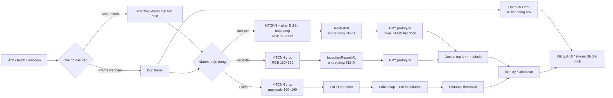

<div align="center">


<p>
  
  
  
  
  
</p>

**So sánh ArcFace, FaceNet và LBPH cho bài toán định danh khuôn mặt có cơ chế từ chối danh tính lạ.**

**Tiếng Việt** | [English](README_EN.md)

</div>

---

# Face Recognition System

Repository triển khai hệ thống nghiên cứu nhận dạng khuôn mặt từ đầu đến cuối: chuẩn bị CelebA, huấn luyện mô hình, xây dựng cơ sở dữ liệu tham chiếu, đối sánh danh tính theo ngưỡng, công cụ đánh giá, trực quan hóa và hai ứng dụng demo.

Bài toán chính là **định danh khuôn mặt dựa trên gallery**. Với ảnh hoặc frame webcam, hệ thống chọn khuôn mặt hợp lệ lớn nhất, tạo deep embedding hoặc dự đoán LBPH, tìm trong tập danh tính đã đăng ký và trả về kết quả phù hợp nhất hoặc `Unknown`. Gallery là tập đóng và hữu hạn; cơ chế từ chối theo ngưỡng tạo ra khả năng open-set giới hạn ở bước suy luận. Đây không phải benchmark open-set hoàn chỉnh hay dịch vụ sinh trắc học sẵn sàng cho production.

> [!IMPORTANT]
> Checkpoint, dataset, embedding database, FAISS index và báo cáo benchmark có thể tái lập không được commit. Chỉ clone repository chưa đủ để nhận dạng. Xem [Tài nguyên bắt buộc](#tài-nguyên-bắt-buộc).

## Định nghĩa bài toán

Repository tách biệt năm tác vụ liên quan:

- **Face detection** xác định vị trí khuôn mặt và trả bounding box; MTCNN và RetinaFace còn có thể trả năm landmark.
- **Face alignment** biến đổi landmark về canonical ArcFace template. Khi không thể align, các luồng có hỗ trợ sẽ fallback sang crop khuôn mặt hoặc resize ảnh.
- **Face embedding** ánh xạ khuôn mặt đã xử lý thành vector 512 chiều được chuẩn hóa bằng ArcFace hoặc FaceNet.
- **Face verification** xuất hiện trong công cụ huấn luyện/đánh giá dưới dạng phân loại cặp cùng người và khác người theo cosine threshold.
- **Face identification / recognition** so sánh query với các danh tính đã đăng ký, lấy kết quả tốt nhất và áp dụng ngưỡng từ chối riêng cho từng mô hình.

Đầu vào gồm file ảnh, batch ảnh upload hoặc frame webcam phía máy chủ. Đầu ra gồm identity, score hoặc distance, top matches khi có, metadata face detection và file trực quan hóa tùy chọn.

## Điểm kỹ thuật chính

- Ba nhánh nhận dạng: ResNet50 ArcFace, InceptionResnetV1 FaceNet và OpenCV LBPH.
- MTCNN detection với năm landmark; detector module còn hỗ trợ RetinaFace tùy chọn và Haar Cascade.
- Ba hợp đồng preprocessing riêng: ArcFace 112×112, FaceNet 160×160 và LBPH grayscale 100×100.
- Deep embedding được L2-normalize, đối sánh bằng cosine similarity và từ chối `Unknown` theo threshold.
- Mỗi danh tính có một prototype embedding, được tạo bằng trung bình các embedding hợp lệ của ảnh tham chiếu.
- FAISS `IndexFlatIP` là tùy chọn cho ArcFace; Flask mặc định vẫn tìm trực tiếp trong NPY dictionary.
- Có kiểm tra verification theo cặp, metric identification, ROC/AUC/EER, confusion matrix và threshold sweep.
- Flask hỗ trợ single image, batch, webcam và background database builder; Streamlit là demo tối giản độc lập.

## Kiến trúc hệ thống



Luồng realtime chỉ dùng Haar Cascade để vẽ bounding box. Mỗi nhánh nhận dạng vẫn tự preprocessing frame đã lưu: ArcFace và FaceNet dùng luồng dựa trên MTCNN; LBPH chạy MTCNN crop riêng trước khi dự đoán.

## Các phương pháp nhận dạng

| Phương pháp | Implementation | Đầu vào và representation | Mục tiêu huấn luyện | Score nhận dạng | Điểm mạnh trong repository | Hạn chế |
| --- | --- | --- | --- | --- | --- | --- |
| **ArcFace** | ResNet50 backbone, ImageNet initialization khi bật, projection 512-D, ArcMargin classification head | Khuôn mặt RGB đã align landmark hoặc crop, 112×112, normalize mean/std `0.5`; embedding L2-normalized | Cross-entropy trên additive angular-margin logits | Cosine similarity; càng cao càng tốt | Angular-margin training và canonical five-point alignment rõ ràng | Cần checkpoint đúng định dạng và embedding đã đăng ký; threshold phải hiệu chỉnh theo validation domain |
| **FaceNet** | `facenet_pytorch.InceptionResnetV1`, VGGFace2 initialization, đầu ra 512-D | MTCNN crop RGB, 160×160, normalize mean/std `0.5`; embedding L2-normalized | Triplet margin loss với random, semi-hard hoặc batch-hard mining | Cosine similarity khi web inference; L2 triplet distance khi huấn luyện | Pretrained embedding backbone và online mining | Luồng detection dùng crop, không áp dụng canonical ArcFace warp |
| **LBPH** | `cv2.face.LBPHFaceRecognizer` | MTCNN crop với raw-image fallback, grayscale, 100×100; local binary-pattern histogram | Native LBPH fitting trên integer label | LBPH distance; càng thấp càng tốt | Baseline traditional CV nhẹ, không cần neural checkpoint | Nhạy với điều kiện chụp; distance không cùng thang đo với cosine similarity |

### Nhánh ArcFace

`models/arcface/arcface_model.py` xây dựng ResNet50 feature extractor, embedding layer 512-D và `ArcMarginProduct` head. Khi có label, mô hình đi qua angular-margin classification path để huấn luyện; khi inference không truyền label và chỉ trả embedding. `inference/extract_embeddings.py` và `RecognitionEngine` L2-normalize embedding trước khi đối sánh.

Cấu hình mặc định `configs/arcface_config.yaml` dùng ảnh 112×112, batch size 128, 150 epoch, SGD `0.01`, step scheduler, warmup, mixed precision, early stopping và ArcFace scale/margin `64.0/0.1`. `configs/arcface_kaggle.yaml` là profile riêng với 250 epoch, cosine scheduler và margin `0.2`; đây là cấu hình thí nghiệm, không phải kết quả benchmark.

### Nhánh FaceNet

`models/facenet/facenet_model.py` bọc `InceptionResnetV1` pretrained trên VGGFace2 và giữ embedding 512-D, trừ khi config yêu cầu projection khác. Huấn luyện dùng `TripletMarginLoss`. CLI mặc định chọn online semi-hard mining; random và batch-hard cũng được hỗ trợ.

Cấu hình mặc định `configs/facenet_config.yaml` dùng ảnh 160×160, batch size 32, 30 epoch, Adam `3e-4`, StepLR, triplet margin `0.5` và bốn ảnh mỗi identity cho online mining. Dataloader kiểm tra train và validation không trùng identity.

### Nhánh LBPH

`models/lbphmodel/train_lbph_script.py` gán integer label ổn định từ các thư mục identity đã sort, mặc định detect/crop khuôn mặt, chuyển ảnh thành grayscale 100×100 và huấn luyện OpenCV LBPH với radius `1`, tám neighbors và grid `8×8`. Script lưu `lbph_model.xml` và `label_map.npy`.

Inference chấp nhận dự đoán khi LBPH distance nhỏ hơn hoặc bằng threshold (`100` trong `configs/lbph_config.yaml`). Web UI còn chuyển distance thành confidence chuẩn hóa chỉ để hiển thị. Giá trị này không phải probability đã hiệu chỉnh và không được so sánh trực tiếp với cosine score của ArcFace hoặc FaceNet. Batch page hiện chọn `best_model` từ các display score khác thang đo; chỉ xem nhãn này là UI heuristic, không phải benchmark giữa mô hình.

## Face detection, alignment và preprocessing

`preprocessing/face_detector.py` hỗ trợ ba backend:

| Backend | Trạng thái | Landmark | Cách chọn khuôn mặt |
| --- | --- | --- | --- |
| MTCNN từ `facenet-pytorch` | Mặc định cho preprocessing, inference ảnh upload và tạo database | Năm điểm | Lọc confidence `0.9`, kích thước tối thiểu 20 px, sau đó chọn khuôn mặt hợp lệ lớn nhất |
| RetinaFace | Tùy chọn; fallback sang MTCNN nếu import thất bại | Năm điểm | Áp dụng confidence/minimum-size đã cấu hình và chọn khuôn mặt lớn nhất |
| OpenCV Haar Cascade | Có sẵn, không có landmark; dùng để vẽ detection realtime | Không | Chọn khuôn mặt lớn nhất |

Khác biệt quan trọng giữa các nhánh:

- **ArcFace:** ước lượng similarity transform từ năm landmark sang canonical template 112×112. Thiếu `scikit-image`, landmark hoặc alignment thành công sẽ kích hoạt crop fallback trong các luồng inference có hỗ trợ.
- **FaceNet:** dùng MTCNN detection và margin crop về 160×160. Luồng inference chính không dùng canonical ArcFace warp.
- **LBPH:** dùng MTCNN crop với margin `0.2`, resize về 100×100 rồi chuyển BGR sang grayscale. Detection thất bại sẽ fallback sang resize ảnh nguồn.
- **Ảnh nhiều khuôn mặt:** các luồng nhận dạng cấp cao hiện chỉ xử lý một khuôn mặt, thường là detection hợp lệ lớn nhất. Hệ thống không trả identity cho mọi khuôn mặt trong ảnh.

## Dataset và chuẩn bị dữ liệu

### Nguồn dữ liệu

CelebA là workflow dữ liệu chính của repository. Ảnh gốc và dataset đã sinh không được commit. Preprocessor chính yêu cầu:

```text
data/
├── img_align_celeba/
│   └── <image>.jpg
└── meta_origin/
    ├── identity_CelebA.txt
    ├── list_landmarks_align_celeba.csv
    ├── list_attr_celeba.csv              # tùy chọn
    └── list_bbox_celeba.csv              # tùy chọn
```

`identity_CelebA.txt` cung cấp label danh tính. Metadata năm landmark cho phép canonical alignment. Attribute và bounding box được load khi có nhưng không bắt buộc để sinh label.

### Quy trình preprocessing

```text
Ảnh CelebA + metadata identity/landmark
    → loại identity dưới số ảnh tối thiểu
    → nhóm ảnh theo identity
    → align ảnh gốc về 112×112
    → augment identity thiếu ảnh
    → chia train / validation / test
    → ghi folder tree và metadata CSV
```

Chạy pipeline local có thể cấu hình:

```bash
python preprocessing/celeba_preprocessing.py \
  --images-dir data/img_align_celeba \
  --meta-dir data/meta_origin \
  --output-dir data/CelebA_Aligned_Balanced \
  --min-images 5 \
  --augment-threshold 10 \
  --target-min 10 \
  --split-method by_identity \
  --seed 42
```

Script hỗ trợ `by_image` và `by_identity`; mặc định CLI là `by_image`. Cần chọn split policy có chủ đích: config FaceNet mặc định yêu cầu identity không trùng nhau (`by_id` trong metadata), còn thí nghiệm classification có thể cần các class xuất hiện ở nhiều split.

Cấu trúc sinh ra:

```text
data/CelebA_Aligned_Balanced/
├── train/<identity>/<image>.jpg
├── val/<identity>/<image>.jpg
├── test/<identity>/<image>.jpg
└── metadata/
    ├── train_labels.csv
    ├── val_labels.csv
    ├── test_labels.csv
    ├── global_id_mapping.csv
    └── dataset_config.json
```

Preprocessing mặc định loại identity có dưới năm ảnh và augment identity có 5–9 ảnh lên mục tiêu mười ảnh. Offline augmentation gồm horizontal flip, rotation nhỏ, thay đổi màu và noise/blur tùy chọn khi có `albumentations`. ArcFace và FaceNet dataloader còn áp dụng augmentation khi huấn luyện theo định nghĩa trong module tương ứng.

`configs/arcface_kaggle.yaml` chứa metadata mô tả dataset cân bằng đã chuẩn bị với 9.343 class và khoảng 18 ảnh/class. Repository không commit dataset manifest đã sinh, vì vậy các số này chỉ là ngữ cảnh cấu hình, không phải dataset release có thể xác minh trực tiếp từ Git.

## Embedding database và quyết định danh tính

Định dạng enrollment mặc định cho deep model là dictionary được lưu bằng NumPy:

```python
{
    "identity_name": np.ndarray(shape=(512,), dtype=...),
    # một normalized prototype cho mỗi identity
}
```

Với mỗi thư mục identity, `inference/extract_embeddings.py` trích xuất embedding từ mọi ảnh hợp lệ, tính trung bình, L2-normalize vector trung bình và lưu một prototype. Query recognition sau đó:

1. trích xuất và L2-normalize query embedding;
2. tính cosine similarity với mọi prototype;
3. sort candidate theo similarity giảm dần;
4. trả tối đa năm kết quả;
5. trả `Unknown` nếu best score thấp hơn threshold.

`RecognitionEngine` mặc định dùng threshold `0.5`; luồng single-image và batch ArcFace/FaceNet của Flask thường dùng `0.65`, còn realtime dùng `0.5`. Đây là default của implementation, không phải operating point đã hiệu chỉnh cho mọi domain. ArcFace web output còn nhân display score với `1.2` và clip tại `1.0`; cần xem đây là score hiển thị, không phải probability.

### Luồng FAISS tùy chọn

Full extraction path của ArcFace có thể tính class prototype và tạo FAISS `IndexFlatIP` trên vector đã normalize. `RecognitionEngine` có thể load index cùng prototype/label file và tìm top-k bằng inner product. Flask hiện khởi tạo ArcFace với `data/arcface_embeddings_db.npy`, nên FAISS chỉ là programmatic path tùy chọn, không phải backend mặc định của web app.

## Huấn luyện

Quy trình chung:

```text
Folder identity / metadata đã chuẩn bị
    → DataLoader và augmentation riêng cho mô hình
    → embedding model và objective
    → optimizer, scheduler, validation, early stopping
    → best/last checkpoint
    → trích xuất enrollment embedding
    → nhận dạng theo threshold
```

### ArcFace

```bash
python models/arcface/train_arcface.py \
  --config configs/arcface_config.yaml \
  --data_dir data/CelebA_Aligned_Balanced \
  --checkpoint_dir models/checkpoints/arcface
```

CLI tùy chọn: `--pretrained_backbone`, `--resume` và `--reset_optimizer`. Trainer lưu `arcface_best.pth`, `arcface_last.pth`, checkpoint theo epoch và training history. TensorBoard và embedding visualization phụ thuộc config cùng package tùy chọn đã cài.

### FaceNet

```bash
python models/facenet/train_facenet.py \
  --config configs/facenet_config.yaml \
  --data_dir data/CelebA_Aligned_Balanced \
  --mining semi_hard
```

Mining strategy hợp lệ: `random`, `semi_hard`, `hard`. Trainer lưu `facenet_best.pth`, `facenet_last.pth` và JSON training history. CLI hiện không có argument resume.

### LBPH

```bash
python models/lbphmodel/train_lbph_script.py \
  --data-dir data/CelebA_Aligned_Balanced/train \
  --output-dir models/checkpoints/LBHP
```

Tìm threshold trên validation tùy chọn:

```bash
python models/lbphmodel/train_lbph_script.py \
  --data-dir data/CelebA_Aligned_Balanced/train \
  --output-dir models/checkpoints/LBHP \
  --find-threshold \
  --val-dir data/CelebA_Aligned_Balanced/val
```

Threshold search ghi analysis cạnh model và cập nhật `configs/lbph_config.yaml`. Đây là thao tác huấn luyện có thay đổi state, không phải command đánh giá read-only.

### Kaggle và Colab

- `requirements-colab.txt` bổ sung `albumentations`, TensorBoard, InsightFace và GPU FAISS.
- `configs/arcface_kaggle.yaml` và `configs/facenet_kaggle.yaml` là profile hướng đến Kaggle.
- `notebooks/arcface_kaggle.ipynb`, `notebooks/facenet_kaggle.ipynb`, notebook preprocessing và các notebook evaluation cung cấp workflow tương tác.

Code fallback sang CPU tại các vị trí có hỗ trợ, nhưng GPU là mục tiêu thực tế để huấn luyện deep model. Cần cài PyTorch/torchvision phù hợp với CUDA runtime của máy thay vì mặc định một phiên bản CUDA cố định.

## Tài nguyên bắt buộc

| Tài nguyên | Path Flask sử dụng | Có trong Git | Cách tạo |
| --- | --- | --- | --- |
| CelebA đã chuẩn bị | `data/CelebA_Aligned_Balanced/` | Không | Chạy `preprocessing/celeba_preprocessing.py` hoặc preprocessing notebook |
| Ảnh enrollment | `data/celeb/<identity>/<image>` trong command ví dụ | Không | Cung cấp một thư mục cho mỗi identity |
| ArcFace checkpoint | `models/checkpoints/arcface/arcface_best.pth` | Không | Huấn luyện ArcFace hoặc cung cấp checkpoint tương thích với project |
| FaceNet checkpoint | `models/checkpoints/facenet/facenet_best.pth` | Không | Huấn luyện FaceNet hoặc cung cấp checkpoint tương thích với project |
| ArcFace prototype DB | `data/arcface_embeddings_db.npy` | Không | Chạy ArcFace database extraction hoặc dùng Database Builder |
| FaceNet prototype DB | `data/facenet_embeddings_db.npy` | Không | Chạy FaceNet database extraction hoặc dùng Database Builder |
| LBPH model và label | `models/checkpoints/LBHP/lbph_model.xml`, `label_map.npy` | Không | Chạy LBPH training hoặc dùng Database Builder |
| FAISS index và mapping | Thường nằm trong `data/embeddings/` | Không | Chạy ArcFace `full` extraction mode với CSV metadata |
| Evaluation output | `results/evaluation/` khi được sinh | Không có reproducible report được track | Gọi evaluation utility với protocol xác định |

### Tạo deep embedding database

Enrollment input phải có một thư mục con cho mỗi identity:

```text
data/celeb/
├── person_a/
│   ├── image_01.jpg
│   └── image_02.jpg
└── person_b/
    └── image_01.jpg
```

ArcFace:

```bash
python inference/extract_embeddings.py \
  --mode db \
  --model-type arcface \
  --model-path models/checkpoints/arcface/arcface_best.pth \
  --data-dir data/celeb \
  --output-path data/arcface_embeddings_db.npy \
  --use-face-detection
```

FaceNet:

```bash
python inference/extract_embeddings.py \
  --mode db \
  --model-type facenet \
  --model-path models/checkpoints/facenet/facenet_best.pth \
  --data-dir data/celeb \
  --output-path data/facenet_embeddings_db.npy \
  --use-face-detection
```

`--no-face-detection` dùng trực tiếp ảnh nguồn; chỉ dùng khi dữ liệu đã được crop và chuẩn hóa đúng hợp đồng của mô hình. Cú pháp Windows bổ sung nằm tại [`docs/extract_embeddings.md`](docs/extract_embeddings.md), nhưng giá trị log trong tài liệu đó chỉ là ví dụ lịch sử, không phải benchmark hiện tại.

## Đánh giá và kết quả

`inference/evaluate.py` cung cấp reusable function, không phải dataset CLI. Output đã triển khai gồm:

- accuracy, weighted/macro precision, recall và F1;
- confidence-threshold sweep với tỷ lệ chấp nhận (`known_ratio`);
- ROC curve, AUC và EER estimate cho binary correctness label;
- confusion matrix;
- Markdown report và plot được sinh tự động.

ArcFace và FaceNet trainer còn ước lượng verification accuracy theo cặp bằng cách sample positive/negative pair và tìm cosine threshold. FaceNet log triplet constraint accuracy, positive/negative distance, validation loss và pair verification accuracy. LBPH evaluation utility báo accepted-sample accuracy và coverage tại distance threshold.

Để so sánh có cơ sở, cần cố định gallery/query partition, hiệu chỉnh threshold riêng cho từng mô hình trên validation data, đánh giá trên held-out query set và báo cả chất lượng nhận dạng lẫn rejection/coverage. Không so sánh trực tiếp LBPH distance hoặc confidence UI suy ra từ distance với cosine similarity của deep model.

**README không công bố bảng benchmark có thể tái lập.** Evaluation code và output notebook lịch sử có tồn tại, nhưng repository không track checkpoint, generated dataset manifest, embedding database và toàn bộ evaluation artifact cần để tái lập độc lập so sánh mô hình. Vì vậy tài liệu không đưa claim về accuracy, AUC, EER, FPS hay state of the art.

## Trực quan hóa explainability

`inference/explainability.py` triển khai:

- ArcFace Grad-CAM, mặc định target `backbone.layer4`, fallback sang convolutional layer cuối;
- FaceNet activation-based CAM dùng `block8.conv2d` khi có, vì nhánh này không dùng embedding gradient;
- sinh heatmap, overlay và ảnh kết hợp.

Flask ghi ArcFace và FaceNet overlay vào `static/gradcam/` cho ảnh đơn được upload. Heatmap biểu diễn vùng kích hoạt trong embedding path; không chứng minh tại sao identity match đúng và không phải causal explanation cho quyết định threshold cuối cùng.

## Ứng dụng

### Ứng dụng Flask

`web_app.py` là entry point chính. Model được lazy load.

| UI route | Chức năng |
| --- | --- |
| `/` | Upload một ảnh, chạy ArcFace, FaceNet và LBPH; hiển thị score, detection metadata/bounding box và ArcFace/FaceNet CAM overlay khi có |
| `/batch` | Xử lý nhiều ảnh bằng cả ba phương pháp |
| `/realtime` | Stream webcam phía server và chọn ArcFace, FaceNet hoặc LBPH |
| `/database-builder` | Khởi chạy background job để tạo ArcFace/FaceNet prototype database hoặc huấn luyện LBPH; theo dõi status và download artifact |

Các route nội bộ phục vụ video stream, chọn model, trạng thái job và download của UI. Chúng không phải REST API production có version và authentication. Flask chạy với `debug=True`; chỉ chạy trong môi trường development được kiểm soát.

Chạy từ repository root:

```bash
python web_app.py
```

Mở `http://127.0.0.1:5000`. Webcam dùng camera index `0` trên máy chạy Flask, không phải camera của browser client.

### Demo Streamlit

`app/app.py` là demo ArcFace single-image độc lập, dùng `RecognitionEngine()` mặc định. Engine này không nhận database path, nên entry point Streamlit hiện tại không thể trả kết quả nhận dạng đã enrollment nếu không đổi code/config. UI cũng ghi rõ kết quả chỉ mang tính minh họa. `streamlit` không có trong requirements của project.

Để xem demo hiện tại:

```bash
python -m pip install streamlit
streamlit run app/app.py
```

## Cài đặt

### Môi trường local

```bash
git clone git@github.com:sin0235/face-recognition-system.git
cd face-recognition-system
python -m venv .venv
source .venv/bin/activate
python -m pip install --upgrade pip
python -m pip install -r requirements.txt
```

`opencv-contrib-python` là bắt buộc cho `cv2.face` và LBPH. `requirements.txt` chứa cả `opencv-python` lẫn `opencv-contrib-python`; cần xác minh environment sau khi cài có `cv2.face`.

Với CUDA, cài PyTorch và torchvision wheel phù hợp driver/runtime của máy. CUDA không bắt buộc cho các luồng inference có CPU fallback; code chọn CPU khi CUDA không khả dụng.

### Thứ tự tái lập

1. Cài dependency local hoặc notebook.
2. Tải CelebA và metadata cần thiết ngoài Git.
3. Chuẩn bị folder train/validation/test đã align với split policy rõ ràng.
4. Huấn luyện mô hình hoặc đặt checkpoint tương thích vào path yêu cầu.
5. Chuẩn bị enrollment folder, tạo ArcFace/FaceNet prototype database; huấn luyện LBPH và giữ label map.
6. Hiệu chỉnh threshold riêng cho từng mô hình trên validation data.
7. Chạy Flask app hoặc gọi inference bằng code.
8. Đánh giá trên protocol held-out cố định và lưu report cùng config/checkpoint identifier chính xác.

## Cấu trúc repository

```text
app/                         Demo Streamlit độc lập
configs/                     Cấu hình ArcFace, FaceNet, LBPH, local và Kaggle
docs/                        Tài liệu bổ sung về embedding extraction
inference/                   Recognition, enrollment, evaluation, CAM và DB job
models/arcface/              ResNet50 ArcFace model, dataloader và trainer
models/facenet/              InceptionResnetV1 wrapper, triplet mining và trainer
models/lbphmodel/            OpenCV LBPH training, threshold và evaluation
notebooks/                   Workflow preprocessing, training, evaluation và analysis
preprocessing/               Multi-backend detector và pipeline chuẩn bị CelebA
scripts/                     Balancing workflow hướng đến Colab và utility hỗ trợ
static/                      Flask asset và runtime visualization
templates/                   Flask UI template
web_app.py                   Ứng dụng Flask chính
requirements.txt             Dependency cho local
requirements-colab.txt       Dependency hướng đến Colab/Kaggle
```

## Hạn chế và sử dụng có trách nhiệm

- Không có anti-spoofing hoặc liveness detection; hệ thống không xử lý ảnh chụp hay replay attack.
- Unknown rejection phụ thuộc threshold. Default không thay thế hiệu chỉnh trên camera, identity và điều kiện vận hành mục tiêu.
- Largest-face selection bỏ qua các khuôn mặt còn lại trong ảnh nhóm.
- Detection và recognition có thể suy giảm do pose, blur, occlusion, ánh sáng, độ phân giải thấp và domain shift.
- Training/evaluation dựa trên CelebA có thể kế thừa demographic bias và collection bias; repository không lưu fairness audit.
- Tìm trực tiếp trên NPY prototype có độ phức tạp tuyến tính theo số identity. FAISS có hỗ trợ nhưng chưa tích hợp vào Flask mặc định.
- Web route thiếu production authentication, authorization, API versioning, persistent job storage và cấu hình deployment đã harden.
- Biometric template và ảnh khuôn mặt là dữ liệu nhạy cảm. Cần có consent, giảm thời gian lưu, giới hạn truy cập và tuân thủ luật riêng tư áp dụng.
- Checkpoint compatibility phụ thuộc model definition và config đã lưu trong repository. Weight từ paper hoặc bên thứ ba không mặc định tương thích.

## Hướng phát triển

- Công bố evaluation protocol có version với immutable split manifest, checkpoint hash, threshold calibration và result artifact được track.
- Chuẩn hóa cách báo cáo cosine similarity và LBPH distance mà không trình bày chúng như probability.
- Thêm output nhiều khuôn mặt và benchmark FAISS path so với direct prototype search.
- Chỉ thêm liveness/anti-spoofing, access control, persistent job và production deployment sau khi xác định biometric threat model.

## Tài liệu tham khảo

- Deng, J. et al. *ArcFace: Additive Angular Margin Loss for Deep Face Recognition*. CVPR 2019.
- Schroff, F. et al. *FaceNet: A Unified Embedding for Face Recognition and Clustering*. CVPR 2015.
- Ahonen, T. et al. *Face Description with Local Binary Patterns: Application to Face Recognition*. IEEE TPAMI 2006.
- Liu, Z. et al. *Deep Learning Face Attributes in the Wild*. ICCV 2015.

## Đóng góp

Mở issue trước khi thực hiện thay đổi lớn. Contribution cần có experiment protocol rõ ràng, không commit dữ liệu sinh trắc học riêng tư hoặc artifact lớn, và giữ mọi claim trong tài liệu truy ngược được về code, config hoặc output có thể tái lập.

## Giấy phép

Phát hành theo [MIT License](LICENSE). Copyright © 2025 Trần Phúc Toàn.
